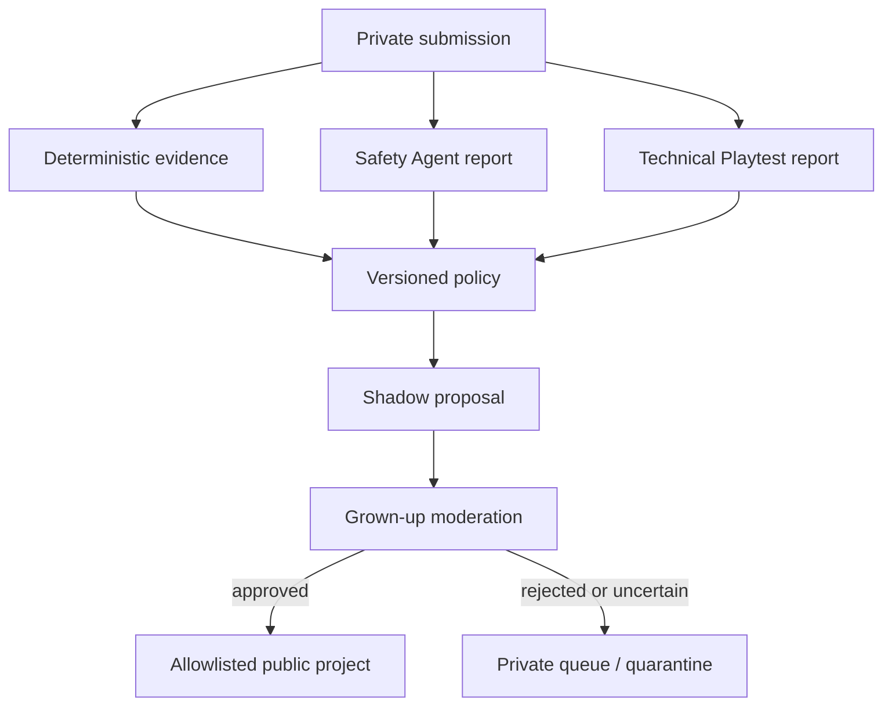

# Agentic Submission Review

## Current seam preserved

The existing private `submissions` intake and allowlisted `projects` gallery remain separate. Only the authenticated `adminModerate` path copies selected kid-facing fields into `projects`; parent contact, consent/legal records, reviewer notes, and safety evidence stay private. The new system is an append-only sidecar. It does not replace `safety_scans` or give the runner a publication route.

## Evidence flow

Each run records submission/challenge references, timestamp, target hash, policy version, deterministic checks, playthrough coverage, network findings, text/image/source results, separate Safety and Technical reports, limitations, model/prompt versions, proposed lane, final publication state, human audit, and override reason. Evidence tables exclude parent contact.

## Lane rules

Green is only a shadow proposal in this milestone. Every required check and evidence kind must be explicit and green; empty, unknown, disagreement, inaccessible source, mutable target, or incomplete coverage is yellow. Personal information, harmful/exploitative material, credential theft, malware/deceptive downloads, hidden tracking, unauthorized ads/payments, child contact, review bypass, dangerous links, or deliberate misrepresentation is red.

Red candidate content must not be opened casually. A future Admin iteration should render sanitized evidence first and require an intentional reveal for untrusted media/links. Parent reviewers must not receive proposed-red rows.

## Runner boundaries

The Playwright runner uses a fresh context, denies permissions, blocks service workers/downloads/popups/disallowed schemes and obvious private-address hosts, records network/console observations, and samples bounded interactions. It still does not constitute a hardened network namespace, comprehensive source audit, DNS-rebinding defense, semantic audio/video review, or exhaustive state coverage. Those limitations force yellow.

OpenAI Responses calls set `store: false`. Screenshots are held in memory for the current moderation/playthrough request and are not inserted into D1 or R2 by the new sidecar. Provider retention and any future screenshot retention require privacy/legal review.

## Separation of duties

- Safety and Technical Playtest reports are different evidence records.
- The Approval evaluator is deterministic over versioned policy; explanatory model text cannot change the lane.
- Evidence payloads are append-only and content-hashed.
- Automated decisions are constrained to `mode = shadow` and `publication_allowed = 0`.
- A human action is recorded separately; overrides need a reason.
- No shadow endpoint writes `projects` or changes a submission to approved.

## Known blockers to green

The legacy scan does not yet prove server-side image normalization, complete source/deployment matching, mobile coverage, all network behavior, or immutable controlled-origin artifacts. Ordinary mutable external demos therefore should not become an initial automatic-approval category.

## Adversarial checks

Fixtures cover obfuscated PII, EXIF/GPS, child images, trackers, downloads, logins, payments, iframes, missing source, coverage gaps, agent disagreement, credentials, prompt injection, stale target/evidence, and review-environment bypass. Migration tests preserve 2026 and enforce shadow/dry-run/off constraints.
